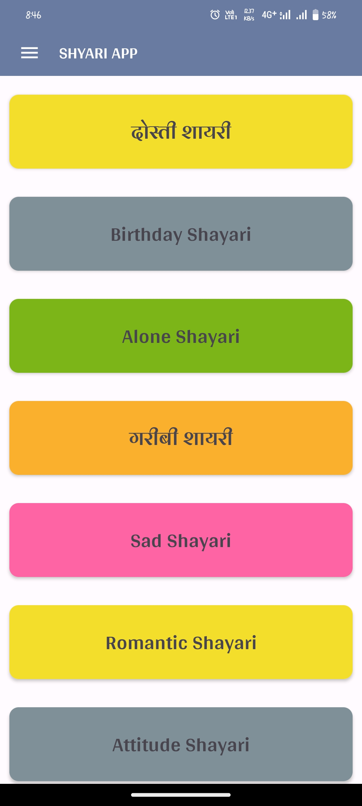
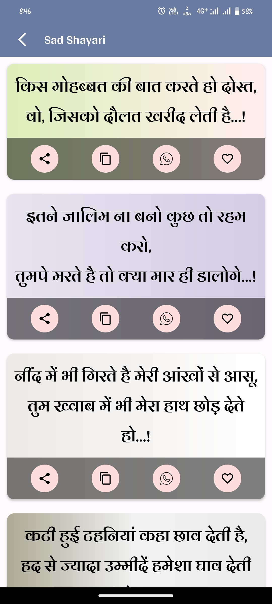
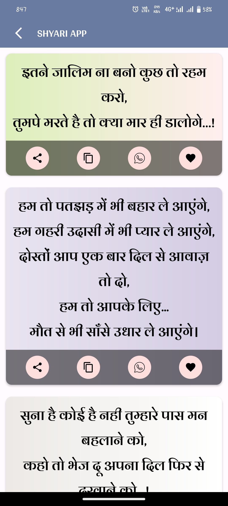

# 🌸 Shayari App - Hindi Quotes & Status

Welcome to the Shayari App — your go-to Android application for reading and enjoying beautiful Hindi Shayaries across various categories.

📱 **Live on Google Play Store:**  
[👉 Download Now](https://play.google.com/store/apps/details?id=com.hindi.shyariapplicationbyanirudhlohiya)

---

## ✨ Features

- 🔖 **Categories of Shayari**  
  Explore a wide variety of Shayari such as Love, Friendship, Sad, Motivation, and more.

- ❤️ **Favorite Any Shayari**  
  Long press or tap the heart icon to mark any Shayari as your favorite.

- 📂 **View Favorited Shayaries**  
  Easily access your collection of favorite Shayaries in one place.

- 📶 **Offline Support**
  Read your favorite Shayaries even without internet.

---

## 📸 Screenshots

| Home | Categories | Favorite Shayari |
|------|------------|------------------|
|  |  |  |

---

## 🛠 Tech Stack

- **Language:** Java / Kotlin (choose one based on your code)
- **Database:** Firebase Realtime Database
- **Authentication:** Firebase Auth
- **UI:** Material Design, Jetpack Libraries
- **Notification:** Firebase Cloud Messaging (if used)

---

## 🙌 Acknowledgements

Made with ❤️ for Shayari lovers  

