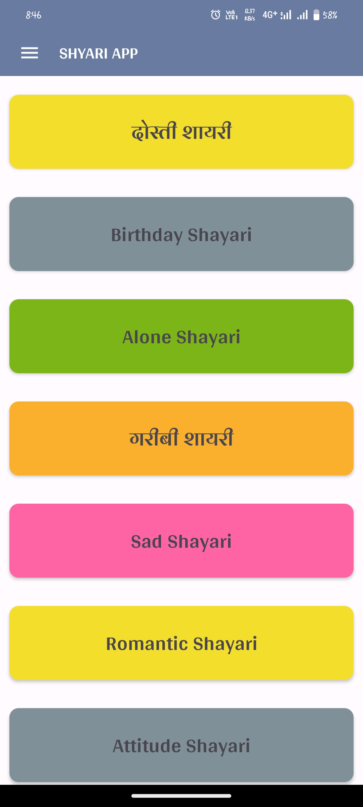
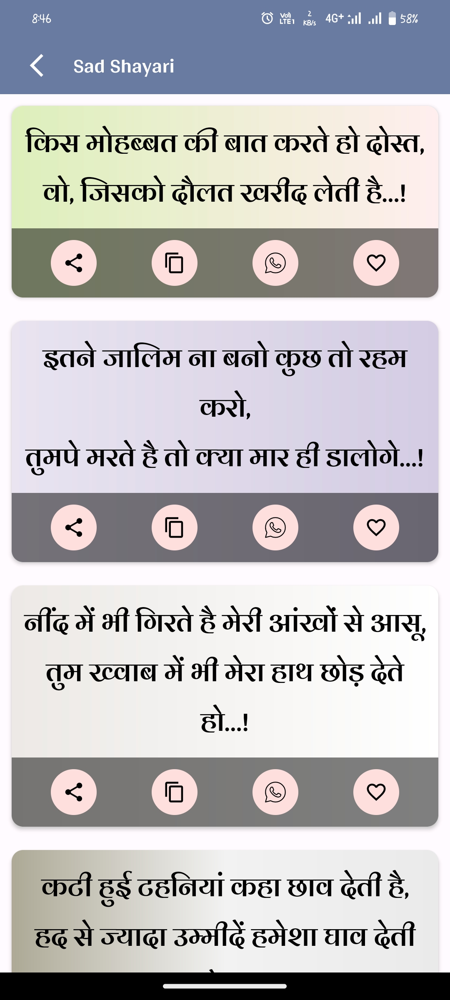
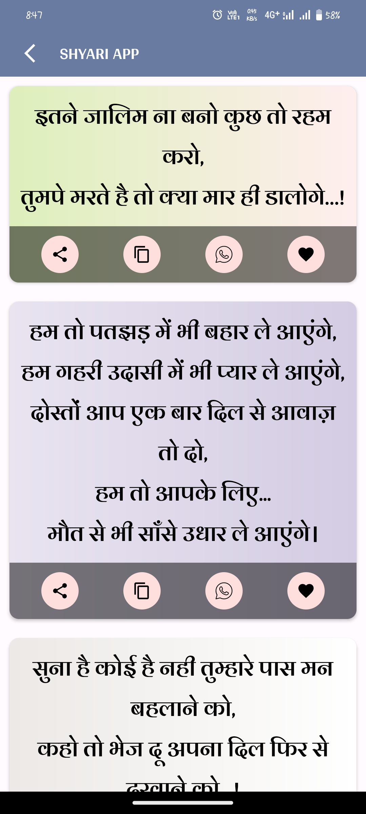

# 🌸 Shayari App - Hindi Quotes & Status

Welcome to the Shayari App — your go-to Android application for reading and enjoying beautiful Hindi Shayaries across various categories.

📱 **Live on Google Play Store:**  
[👉 Download Now](https://play.google.com/store/apps/details?id=com.hindi.shyariapplicationbyanirudhlohiya)

---

## ✨ Features

- 🔖 **Categories of Shayari**  
  Explore a wide variety of Shayari such as Love, Friendship, Sad, Motivation, and more.

- ❤️ **Favorite Any Shayari**  
  Long press or tap the heart icon to mark any Shayari as your favorite.

- 📂 **View Favorited Shayaries**  
  Easily access your collection of favorite Shayaries in one place.

- 📶 **Offline Support**
  Read your favorite Shayaries even without internet.

---

## 📸 Screenshots

| Home | Categories | Favorite Shayari |
|------|------------|------------------|
|  |  |  |

---

## 🛠 Tech Stack

### Frontend (Android Application)
- **Language:** Kotlin
- **UI Framework:** Android SDK with Material Design Components
- **UI Libraries:** 
  - AndroidX AppCompat
  - Material Components (com.google.android.material)
  - ConstraintLayout
  - ViewBinding
- **RecyclerView:** For displaying lists of Shayari and Categories

### Backend & Database
- **Backend Service:** Firebase (Backend-as-a-Service)
- **Database:** Firebase Firestore (NoSQL Cloud Database)
- **Cloud Messaging:** Firebase Cloud Messaging (FCM) for push notifications

### Build & Configuration
- **Build System:** Gradle (Kotlin DSL)
- **Minimum SDK:** API 24 (Android 7.0)
- **Target SDK:** API 36

---

## 🙌 Acknowledgements

Made with ❤️ for Shayari lovers  

